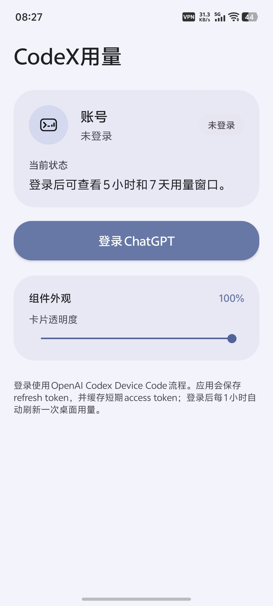
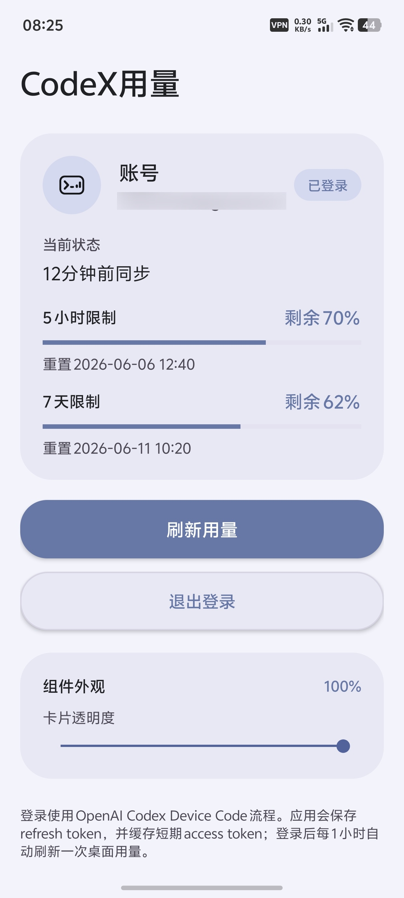
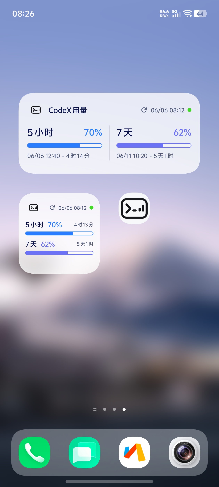

# CodeX Usage Widget

CodeX Usage Widget 是一个原生 Android 桌面小组件，用于展示 ChatGPT Codex 的 5 小时和 7 天用量窗口状态。

## 功能

- 通过 Codex Device Code 登录流程完成 ChatGPT 授权。
- 在应用私有 `SharedPreferences` 中保存认证状态，并在 access token 到期前刷新。
- 查询 ChatGPT Web 后端用量接口，解析 Codex 5 小时和 7 天窗口。
- 提供 2x2 和 4x2 两种桌面小组件尺寸。
- 展示账号、最近同步时间、剩余额度百分比和重置倒计时。
- 支持点击小组件打开应用，或通过刷新按钮触发后台同步。

## 界面预览

| 登录界面 | 登录后界面 | 桌面图标和小组件 |
| --- | --- | --- |
|  |  |  |

## 数据接口

项目使用的用量数据来自 ChatGPT Web 后端接口：

```text
https://chatgpt.com/backend-api/wham/usage
```

该接口不是 OpenAI Platform Usage API，可能会随 ChatGPT/Codex Web 后端调整而变化。

## 技术栈

- Android Gradle Plugin 8.7.3
- Java
- AndroidX WorkManager 2.10.0
- Minimum SDK 23
- Target SDK 35

## 构建

使用 Android Studio 打开项目并等待 Gradle 同步，或在已配置 Android SDK 的环境中执行：

```bash
./gradlew assembleDebug
```

生成的 debug APK 位于：

```text
app/build/outputs/apk/debug/app-debug.apk
```

## 使用

1. 安装并启动应用。
2. 按界面提示完成 Codex Device Code 授权。
3. 返回 Android 桌面，添加 `CodeX用量 2x2` 或 `CodeX用量 4x2` 小组件。
4. 小组件会显示最近一次同步到的 Codex 用量信息。

## 项目结构

```text
app/src/main/java/com/lichen/codexusage/
  MainActivity.java                 应用主界面与登录流程
  CodexUsageClient.java             授权、token 刷新与用量查询
  CodexAuthStore.java               本地认证状态存储
  UsageState.java                   用量状态模型与持久化
  UsageRefreshWorker.java           后台刷新任务
  UsageRefreshScheduler.java        刷新任务调度
  CodeXWidgetProvider.java          4x2 小组件入口
  CodeXWidgetCompactProvider.java   2x2 小组件入口
  WidgetUpdater.java                小组件渲染逻辑

app/src/main/res/
  layout/                           小组件布局
  drawable/                         小组件和按钮资源
  xml/                              小组件尺寸与配置
```

## 注意事项

- 本项目依赖 ChatGPT Web 后端的 Codex 用量接口，不保证长期稳定。
- refresh token 仅保存在应用私有存储中，不会写入仓库或外部文件。
- `local.properties`、构建产物和 IDE 本地配置已通过 `.gitignore` 排除。
