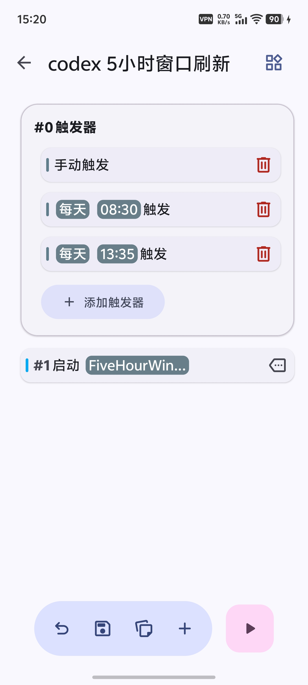
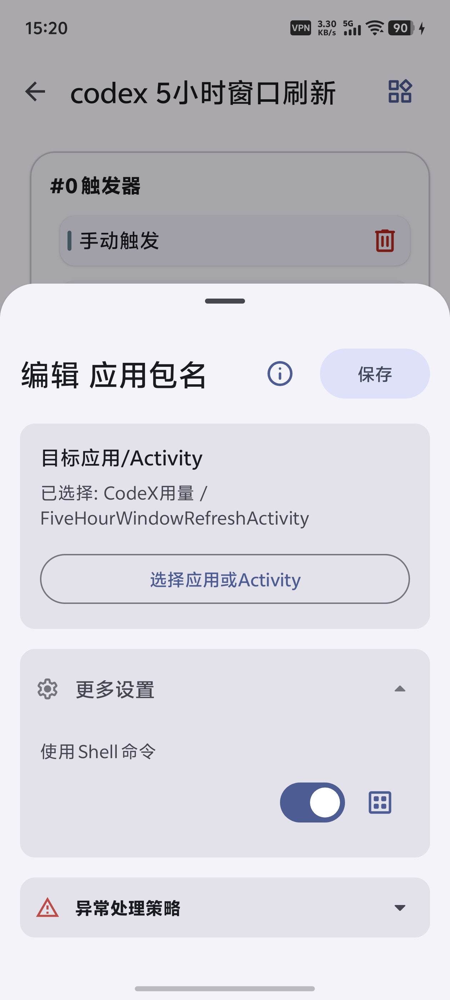

# CodeX Usage Widget

CodeX Usage Widget 是一个 Android 小工具，用来盯住 ChatGPT Codex 的 5 小时和 7 天用量窗口，并在需要时触发一次 Codex Cloud 会话来刷新 5 小时窗口。

对 Codex Plus 用户来说，最难受的不是额度少，而是不知道什么时候快用完：token 剩着怕浪费，用到关键步骤又突然进入冷却。这个应用的目标很直接：把剩余额度放到手机主界面上，让你随时知道还能干多久；再配合自动化定时刷新 5 小时窗口，尽量减少关键工作被冷却期打断的概率。

## 核心功能

1. 查看 Codex 用量

   登录 ChatGPT 后，应用会展示 Codex 5 小时窗口和 7 天窗口的剩余额度、重置时间、最近同步时间，并提供 2x2 和 4x2 桌面小组件。

2. 刷新 5 小时窗口

   配置一个 Codex Cloud 云端环境后，可以在主界面手动触发 `刷新 5 小时窗口`，也可以通过外部自动化工具定时启动触发 Activity。刷新动作本质上是基于所选云端环境发送一次 Codex 会话任务。

小特性：

- 使用 Codex Device Code 登录，验证码会自动复制到剪贴板。
- 主界面和小组件支持深色模式。
- 主界面会根据系统壁纸主色生成配色。
- 小组件支持点击打开应用，也支持刷新用量。

## 使用方式

### 1. 登录并查看用量

安装应用后，按界面提示完成 Codex Device Code 授权。登录成功后可以在主界面查看用量，也可以把小组件添加到桌面。

| 登录界面 | 登录后界面 | 桌面图标和小组件 |
| --- | --- | --- |
|  |  |  |

### 2. 开启 5 小时窗口刷新

进入设置，打开 `5 小时窗口刷新`，选择一个 Codex Cloud 环境。保存后，主界面会出现 `刷新 5 小时窗口` 按钮。

| 开启 5 小时窗口刷新后的主界面 | 5 小时窗口刷新设置 |
| --- | --- |
|  |  |

使用 `5 小时窗口刷新` 功能前，需要先在 Codex Cloud 网页版完成云端环境配置：

```text
https://chatgpt.com/codex/cloud
```

1. 使用 GitHub 连接器连接一个简单的仓库。
2. 基于该仓库创建一个 Codex Cloud 云端环境。

应用设置页中的环境列表来自当前 ChatGPT 账号已经创建好的 Codex Cloud 环境。没有可用环境时，刷新功能无法提交任务。

### 3. 配置自动化刷新

外部自动化程序建议通过导出的触发 Activity 调用 5 小时窗口刷新：

```bash
adb shell am start \
  -a com.lichen.codexusage.ACTION_REFRESH_FIVE_HOUR_WINDOW \
  -n com.lichen.codexusage/.FiveHourWindowRefreshActivity
```

该入口只负责入队后台任务并立即关闭，不会打开主界面。它会读取本地保存的开关和环境 ID；只有开关已打开且环境 ID 非空时才会通过 WorkManager 提交刷新任务。

不推荐使用 `am broadcast` 触发。部分 Android 版本、系统定制或自动化运行环境会限制导出广播的投递或后台执行，可能出现命令返回成功但应用侧没有实际动作的情况。

可以使用开源自动化工具 [vFlow](https://github.com/ChaoMixian/vFlow) 定时启动 `FiveHourWindowRefreshActivity`。实测配置方式如下：

| vFlow 触发器配置 | vFlow Activity 配置 |
| --- | --- |
|  |  |

在 vFlow 的启动步骤中选择目标应用 `CodeX用量`，Activity 选择 `FiveHourWindowRefreshActivity`；启用 Shell 命令选项后，由 vFlow 按定时触发规则启动该 Activity。

## 构建

使用 Android Studio 打开项目并等待 Gradle 同步，或在已配置 Android SDK 的环境中执行：

```bash
./gradlew assembleDebug
```

生成的 debug APK 位于：

```text
app/build/outputs/apk/debug/app-debug.apk
```

Release 构建：

```bash
./gradlew assembleRelease
```

```text
app/build/outputs/apk/release/
```

Release 会生成 `universal`、`arm64-v8a`、`armeabi-v7a`、`x86`、`x86_64` APK。本项目没有 native 库，通常安装 universal APK 即可。

## 技术栈

- Java
- Android Gradle Plugin 8.7.3
- AndroidX WorkManager 2.10.0
- Minimum SDK 23（Android 6.0）
- Target SDK 35（Android 15）

## 项目结构

```text
app/src/main/java/com/lichen/codexusage/
  MainActivity.java                  应用主界面与登录流程
  SettingsActivity.java              5 小时窗口刷新配置页
  FiveHourWindowRefreshActivity.java 外部刷新 5 小时窗口 Activity 入口
  FiveHourWindowRefreshWorker.java   外部刷新 5 小时窗口后台任务
  FiveHourWindowRefreshReceiver.java 外部刷新 5 小时窗口广播入口（兼容保留，不推荐）
  CodexUsageClient.java              授权、token 刷新、用量查询与刷新任务提交
  CodexAuthStore.java                本地认证状态存储
  CodexSettingsStore.java            本地功能配置存储
  UsageState.java                    用量状态模型与持久化
  UsageRefreshWorker.java            后台用量刷新任务
  UsageRefreshScheduler.java         后台用量刷新调度
  CodeXWidgetProvider.java           4x2 小组件入口
  CodeXWidgetCompactProvider.java    2x2 小组件入口
  WidgetUpdater.java                 小组件渲染逻辑

app/src/main/res/
  layout/                            小组件布局
  drawable/                          小组件和按钮资源
  xml/                               小组件尺寸与配置
```

## 接口和注意事项

项目使用 ChatGPT Web 后端接口获取 Codex 用量：

```text
https://chatgpt.com/backend-api/wham/usage
```

5 小时窗口刷新功能还会使用：

```text
GET  https://chatgpt.com/backend-api/wham/environments
POST https://chatgpt.com/backend-api/wham/tasks
```

这些接口不是 OpenAI Platform Usage API，可能会随 ChatGPT/Codex Web 后端调整而变化。

其他注意事项：

- refresh token 仅保存在应用私有存储中，不会写入仓库或外部文件。
- `local.properties`、构建产物和 IDE 本地配置已通过 `.gitignore` 排除。
- 如果需要本地 APK 覆盖 GitHub Release APK，必须使用同一把签名 key，并保证本地 `versionCode` 不低于已安装版本。
