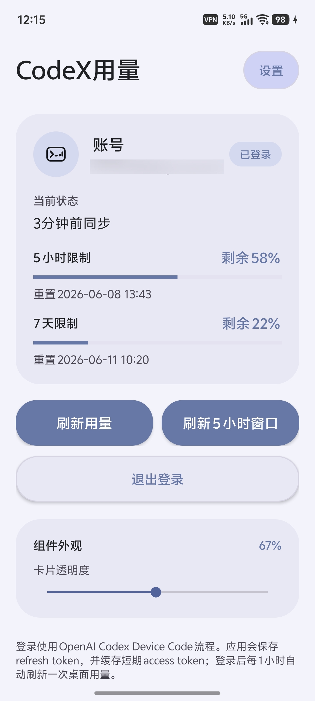
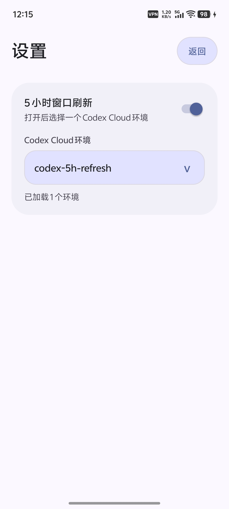

# CodeX Usage Widget

CodeX Usage Widget 是一个原生 Android 桌面小组件，用于展示 ChatGPT Codex 的 5 小时和 7 天用量窗口状态。

## 功能

- 通过 Codex Device Code 登录流程完成 ChatGPT 授权。
- 在应用私有 `SharedPreferences` 中保存认证状态，并在 access token 到期前刷新。
- 查询 ChatGPT Web 后端用量接口，解析 Codex 5 小时和 7 天窗口。
- 提供 2x2 和 4x2 两种桌面小组件尺寸。
- 展示账号、最近同步时间、剩余额度百分比和重置倒计时。
- 支持点击小组件打开应用，或通过刷新按钮触发后台同步。
- 支持配置 Codex Cloud 环境，并手动或通过外部 Intent Action 提交 5 小时窗口刷新任务。
- 获取登录验证码后自动复制到剪贴板，便于在授权页面直接粘贴。
- 主界面会读取系统壁纸颜色，并基于壁纸主色生成应用配色。
- 主界面和桌面小组件均支持系统深色模式。

## 界面预览

| 登录界面 | 登录后界面 | 桌面图标和小组件 |
| --- | --- | --- |
|  |  |  |

| 开启 5 小时窗口刷新后的主界面 | 5 小时窗口刷新设置 |
| --- | --- |
|  |  |

## 数据接口

项目使用的用量数据来自 ChatGPT Web 后端接口：

```text
https://chatgpt.com/backend-api/wham/usage
```

5 小时窗口刷新功能还会使用以下 ChatGPT Web 后端接口：

```text
GET  https://chatgpt.com/backend-api/wham/environments
POST https://chatgpt.com/backend-api/wham/tasks
```

这些接口不是 OpenAI Platform Usage API，可能会随 ChatGPT/Codex Web 后端调整而变化。

## 技术栈

- Android Gradle Plugin 8.7.3
- Java
- AndroidX WorkManager 2.10.0
- Minimum SDK 23（Android 6.0 Marshmallow）
- Target SDK 35（Android 15）

最低支持 Android 6.0/API 23。项目当前核心能力包括桌面小组件、SharedPreferences、本地剪贴板、网络请求和 WorkManager 后台刷新；壁纸取色等较新系统能力已经在代码中按 API 等级做运行时判断并提供降级路径，因此不需要为了这些增强特性提高最低版本。

## 构建

使用 Android Studio 打开项目并等待 Gradle 同步，或在已配置 Android SDK 的环境中执行：

```bash
./gradlew assembleDebug
```

生成的 debug APK 位于：

```text
app/build/outputs/apk/debug/app-debug.apk
```

Release 构建会生成通用 APK 以及常见 ABI 的 APK：

```bash
./gradlew assembleRelease
```

```text
app/build/outputs/apk/release/
```

包括 `universal`、`arm64-v8a`、`armeabi-v7a`、`x86`、`x86_64`。本项目没有 native 库，通用 APK 可安装在这些 CPU 架构的设备上；ABI 包主要用于发布页按设备架构下载。

## 本地签名和安装

Android 不允许用不同签名的 APK 覆盖安装同一个 `applicationId`。本地 `assembleDebug` 使用本机 debug keystore；GitHub Release 如果未配置正式签名，会使用 GitHub runner 上的 debug key；两者签名不同，不能互相覆盖安装。

如果希望 GitHub Release 下载的 APK 和本地打包 APK 可以互相覆盖安装，需要使用同一把 release keystore：

1. 准备一个固定的 release keystore，并妥善保存，不要提交到仓库。
2. 在本地 `local.properties` 中配置签名信息。
3. 在 GitHub Secrets 中配置同一把 keystore 和密码。
4. 本地使用 `assembleRelease` 构建安装包，不要用 `assembleDebug` 覆盖 GitHub Release 包。

本地 `local.properties` 示例：

```properties
CODEX_USAGE_KEYSTORE_FILE=/absolute/path/codex-usage-release.jks
CODEX_USAGE_KEYSTORE_PASSWORD=your-store-password
CODEX_USAGE_KEY_ALIAS=codex-usage
CODEX_USAGE_KEY_PASSWORD=your-key-password
CODEX_USAGE_VERSION_NAME=1.1.0-local
CODEX_USAGE_VERSION_CODE=27116082023
```

`CODEX_USAGE_VERSION_CODE` 需要大于等于手机上已安装版本的 `versionCode`；GitHub Release 的 `versionCode` 使用 GitHub Actions run number。签名一致但 `versionCode` 更低时，Android 仍会拒绝安装。

配置后本地构建 release APK：

```bash
./gradlew assembleRelease
```

如果只是临时测试，也可以先卸载手机上的旧版本再安装本地 APK，但这会清除应用本地数据：

```bash
adb uninstall com.lichen.codexusage
```

## 自动发版

仓库包含 GitHub Actions 工作流 `.github/workflows/android-release.yml`。推送 `v*` tag 后会自动构建 release APK，上传工作流产物，并发布到对应 GitHub Release。

```bash
git tag v1.0.0
git push origin v1.0.0
```

CI 会从 tag 生成 `versionName`，例如 `v1.0.0` 对应 `1.0.0`；`versionCode` 使用 GitHub Actions run number。

如需使用正式签名，在仓库 Secrets 中配置：

```text
ANDROID_KEYSTORE_BASE64
ANDROID_KEYSTORE_PASSWORD
ANDROID_KEY_ALIAS
ANDROID_KEY_PASSWORD
```

未配置签名密钥时，CI 会使用 debug key 签名 release APK，便于 GitHub Release 侧载安装测试；正式分发建议配置独立 release keystore。

## 使用

1. 安装并启动应用。
2. 按界面提示完成 Codex Device Code 授权。
3. 应用获取登录验证码后会自动复制到剪贴板，在授权页面粘贴即可。
4. 返回 Android 桌面，添加 `CodeX用量 2x2` 或 `CodeX用量 4x2` 小组件。
5. 小组件会显示最近一次同步到的 Codex 用量信息，并跟随系统深色模式。
6. 如需刷新 5 小时窗口，在主界面进入设置，打开 `5 小时窗口刷新`，选择一个 Codex Cloud 环境；保存后主界面会显示 `刷新 5 小时窗口` 按钮。

外部自动化程序建议通过导出的触发 Activity 调用 5 小时窗口刷新：

```bash
adb shell am start \
  -a com.lichen.codexusage.ACTION_REFRESH_FIVE_HOUR_WINDOW \
  -n com.lichen.codexusage/.FiveHourWindowRefreshActivity
```

该入口只负责入队后台任务并立即关闭，不会打开主界面。仍然保留广播入口作为备选：

```bash
adb shell am broadcast \
  -a com.lichen.codexusage.ACTION_REFRESH_FIVE_HOUR_WINDOW \
  -n com.lichen.codexusage/.FiveHourWindowRefreshReceiver
```

该动作会读取本地保存的开关和环境 ID；只有开关已打开且环境 ID 非空时才会通过 WorkManager 入队并提交任务。

## 5 小时窗口刷新前提条件

使用 `5 小时窗口刷新` 功能前，需要先在 Codex Cloud 网页版完成云端环境配置：

```text
https://chatgpt.com/codex/cloud
```

1. 使用 GitHub 连接器连接一个简单的仓库。
2. 基于该仓库创建一个 Codex Cloud 云端环境。

应用设置页中的 Codex Cloud 环境列表来自当前 ChatGPT 账号已经创建好的云端环境。`刷新 5 小时窗口` 会基于所选云端环境发送一次 Codex 会话任务，因此必须先有可用的云端环境 ID。

## 项目结构

```text
app/src/main/java/com/lichen/codexusage/
  MainActivity.java                 应用主界面与登录流程
  SettingsActivity.java             5 小时窗口刷新配置页
  FiveHourWindowRefreshActivity.java 外部刷新 5 小时窗口 Activity 入口
  CodexUsageClient.java             授权、token 刷新、用量查询与刷新任务提交
  CodexAuthStore.java               本地认证状态存储
  CodexSettingsStore.java           本地功能配置存储
  UsageState.java                   用量状态模型与持久化
  UsageRefreshWorker.java           后台刷新任务
  UsageRefreshScheduler.java        刷新任务调度
  FiveHourWindowRefreshReceiver.java 外部刷新 5 小时窗口广播入口
  FiveHourWindowRefreshWorker.java  外部刷新 5 小时窗口后台任务
  CodeXWidgetProvider.java          4x2 小组件入口
  CodeXWidgetCompactProvider.java   2x2 小组件入口
  WidgetUpdater.java                小组件渲染逻辑

app/src/main/res/
  layout/                           小组件布局
  drawable/                         小组件和按钮资源
  xml/                              小组件尺寸与配置
```

## 注意事项

- 本项目依赖 ChatGPT Web 后端的 Codex 用量接口，不保证长期稳定。
- 5 小时窗口刷新功能依赖 Codex Cloud 环境列表和任务创建接口；如果 Web 后端字段或鉴权方式变化，可能需要同步调整。
- refresh token 仅保存在应用私有存储中，不会写入仓库或外部文件。
- `local.properties`、构建产物和 IDE 本地配置已通过 `.gitignore` 排除。
